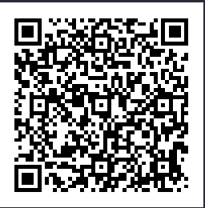

# Fake Product Detection Using Hyperledger Fabric

Fake products is a big problem in every industry. Blockchain is a technology that can be very helpful in
tackling this problem.

Hyperledger Fabric is an open source enterprise-grade permissioned distributed ledger technology (DLT) platform,
designed for use in enterprise contexts, that delivers some key differentiating capabilities over other popular
distributed ledger or blockchain platforms.

You can read more about Hyperledger Fabric at https://hyperledger-fabric.readthedocs.io

## Run Locally

### Prerequisites

Make sure you have installed Hyperledger
Fabric [Prerequisites](https://hyperledger-fabric.readthedocs.io/en/release-2.5/prereqs.html),
especially [Hyperledger Fabric CLI tool binaries](https://hyperledger-fabric.readthedocs.io/en/release-2.5/install.html#install-fabric-and-fabric-samples).

### Install the Fabric Network

Install from command line

```bash
./network.sh install
```

### Remove the Fabric Network (including volumes mounted to docker containers and certificates)

```bash
./network.sh clean
```

After installing the chaincode, you can invoke the chaincode using `peer` binary.

Invoking chaincode through CLI can be tedious, especially if you don't know the about the necessary arguments to be
passed in.

Alternatively, you can use the REST API. ⬇️

## Asset Transfer REST API

This is a simple REST server written in golang with endpoints for chaincode invoke and query.

### Note ⚠️

1. The API server, by default uses credentials of `Manufacturer` user. To change this modify path
   in [main.go](https://github.com/Vyom-Yadav/Fake-Product-Detection-Hyperledger/blob/master/asset-transfer/rest-api-go/main.go)
2. There is only a single channel and a single chaincode deployed on that channel, so those values are hardcoded.
3. While invoking `TransferAssetTo...` function, make sure correct user is being used as ABAC is enabled. Also make sure
   arguments supplied for name and address actually belong to a registered user.
4. If receiving the error

```
   panic: proto: file “msp/identities.proto” is already registered
   See https://developers.google.com/protocol-buffers/docs/reference/go/faq#namespace-conflict
   ...
```

Run using the command: `GOLANG_PROTOBUF_REGISTRATION_CONFLICT=warn go run main.go`

### Usage

- Setup fabric test network and deploy the asset transfer chaincode
  by [following these instructions](https://github.com/Vyom-Yadav/Fake-Product-Detection-Hyperledger/blob/master/README.md).

- cd into `./asset-transfer/rest-api-go` directory
- Download required dependencies using `go mod download`
- Run `go run main.go` to run the REST server

### Sending Requests

Invoke endpoint accepts POST requests with chaincode function and arguments. Query endpoint accepts get requests with
chaincode function and arguments.

Sample chaincode invoke for the "TransferAssetToRetailer" function. Response will contain transaction ID for a
successful invoke.

``` sh
curl --request POST \
  --url http://localhost:3000/invoke \
  --header 'content-type: application/x-www-form-urlencoded' \
  --data = \
  --data function=TransferAssetToRetailer \
  --data args=product1 \
  --data args='Jain Medicos' \
  --data args='DSS 11 sector 20 Panchkula-Haryana-India'
```

Sample chaincode query for getting all asset details.

``` sh
curl --request GET \
  --url 'http://localhost:3000/query?function=GetAllAssets'
```

## QR Codes and Fake Product Detection

Whenever you run the REST API server, QR codes for products are generated (pointing to the same address, by default `http://localhost:3000`).

The QR Codes generated are in `./qr-codes` directory.

 

The idea is that end consumer or retailer or even different manufacturer can scan the QR code to view the details of the product, it's current owner and it's address. 

These details are unique (can be replaced by GPS co-ordinates too, try implementing it!) and act as a proof
of ownership of product. As soon as someone buys a product, the owner has to transfer ownership to the new owner, the new owner can scan again immediately to verify the same.

## Chaincode functions

| Function Name           | Argument 1         | Argument 2            | Argument 3               |
|-------------------------|--------------------|-----------------------|--------------------------|
| InitLedger              |                    |                       |                          |
| CreateAsset             | productId `string` | productType `string`  |                          |
| ReadAsset               | productID `string` |                       |                          |
| UpdateAsset             | productId `string` | productType `string`  |                          |
| DeleteAsset             | productID `string` |                       |                          |
| AssetExists             | productID `string` |                       |                          |
| TransferAssetToRetailer | productID `string` | newOwnerName `string` | newOwnerAddress `string` |
| TransferAssetToConsumer | productID `string` |                       |                          |
| GetAllAssets            |                    |                       |                          |


